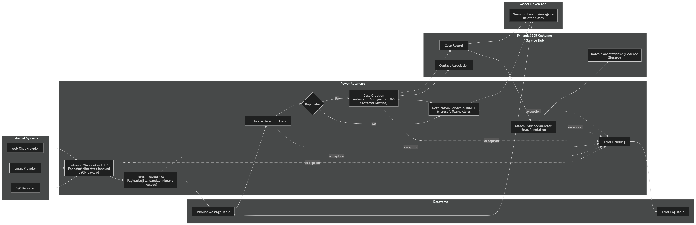

# **Inbound Case Management – Dynamics 365 Customer Service**

## **Overview**

The **Inbound Case Management** solution provides an automated and standardized process for converting inbound customer messages into **Dynamics 365 Customer Service Cases**. The system ensures:

*   Consistent processing across multiple channels
*   Preservation of original message content for audit and compliance
*   Automated case creation and routing
*   Real‑time notifications to case handling teams

The workflow leverages **Microsoft Power Automate**, **Dataverse**, and **Dynamics 365 Customer Service**.

***

## **Business Scenario**

Organizations often receive customer inquiries through channels such as:

*   SMS
*   Email
*   Web Chat

To maintain operational efficiency and compliance, inbound messages must be:

*   Normalized across all channels
*   Stored with original content intact
*   Automatically converted into Case records
*   Routed and escalated through automated workflows

This solution centralizes the full inbound message lifecycle using the Microsoft Power Platform.

***

## **Architecture Overview**

The **Inbound Case Management Workflow** follows an event‑driven architecture built with:

*   Power Automate (Cloud Flows)
*   Microsoft Dataverse
*   Dynamics 365 Customer Service Hub

### **Core Components**

#### **External Systems**

*   SMS, Email, and Web Chat providers

#### **Inbound Webhook**

*   Power Automate HTTP trigger
*   Receives structured JSON payloads

### **Sample Inbound Payload**

```json
{
  "Source": "Phone",
  "From": "+63nnnnnnnnn",
  "To": "+63nnnnnnnnn",
  "Body": "Order #23 checking on delivery status",
  "ReceivedUtc": "2025-11-24T03:20:00Z",
  "MessageId": "MSG000020"
}
```

#### **Dataverse**

*   Inbound Message Table
*   Duplicate Detection Logic
*   Error Log Table

#### **Dynamics 365 Customer Service**

*   Automated case creation
*   Contact resolution and association
*   Evidence attachment via Notes/Annotations

#### **Notifications**

*   Microsoft Teams Adaptive Cards
*   Outlook email alerts via Power Automate

#### **Model-Driven App**

*   Views for Inbound Messages
*   Case tracking and navigation

***

## **Architecture Diagram**

 

***

## **Solution Components**

The solution contains **five core cloud flows**, each handling one part of the inbound lifecycle.

***

### **1. InboundWebhook\_Receive**

Responsible for:

*   Receiving inbound JSON from external systems
*   Creating Inbound Message record
*   Duplicate detection
*   Error logging

***

### **2. InboundWebhook\_CaseCreate**

Automatically:

*   Creates a Case in Dynamics 365
*   Associates the Case with a Contact (when matched)
*   Prepares additional metadata for downstream processes

***

### **3. InboundWebhook\_AttachEvidence**

Ensures compliance by:

*   Attaching original inbound message content
*   Creating Dataverse Note/Annotation linked to the newly created Case

***

### **4. InboundWebhook\_Notify**

Sends automated notifications via:

*   Microsoft Teams (Adaptive Card)
*   Outlook email

Notification contains:

*   Message summary
*   Case details
*   Links to evidence and Case record

***

### **5. InboundWebhook\_Log**

Dedicated to operational logging:

*   Error details
*   Processing diagnostics
*   Exceptions for retry or follow‑up

***

## **Adaptive Cards & Notifications**

### **Microsoft Teams Adaptive Card**

Displays:

*   Case title
*   Message preview
*   Source information
*   Quick‑link to Dynamics 365 Case

### **Outlook Email Notification**

Includes:

*   Summary of inbound message
*   Case reference
*   Link to Dynamics 365

***

## **Testing & Integration**

### **Postman Testing using OAuth**

The webhook can be tested using OAuth-secured API calls in Postman.  
Supports sending structured JSON requests to simulate real inbound traffic.

***

### **Dynamics 365 Customer Service Integration**

Implementation includes:

*   Automatic Case creation
*   Contact mapping
*   Evidence attachments
*   Case timeline updates

***

### **Model‑Driven App: Inbound Case Management**

The solution includes a dedicated model‑driven app providing:

*   Dashboard of inbound items
*   Case linkage monitoring
*   System logging visibility

***

## **Email Templates**

Templates used in the notification flows include:

*   Case creation alerts
*   Message summary
*   Embedded links to Dynamics 365 and Dataverse records

***

## **License Requirements**

*   Power Automate per‑flow or per‑user license
*   Dynamics 365 Customer Service Enterprise
*   Dataverse storage allocation
*   Azure AD App Registration (for OAuth testing)

***

## **Deployment Checklist**

*   [ ] Import solution into target environment
*   [ ] Configure environment variables
*   [ ] Update webhook URL in external SMS / Email / Chat provider
*   [ ] Configure Teams channel & Outlook recipients
*   [ ] Validate Postman API testing
*   [ ] Activate flows
